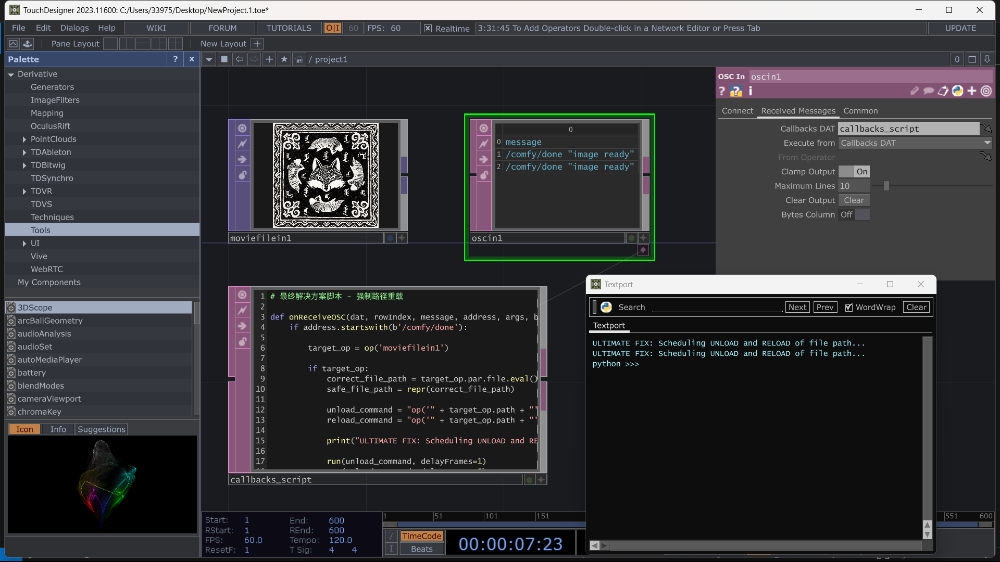

# TouchDesigner OSC 集成

以下是一个 TouchDesigner 脚本，用于在接收到 ComfyUI 文件保存器的 OSC 消息时自动重新加载指定的文件路径。

## 功能说明

当 ComfyUI 文件保存器节点完成图像保存并发送 OSC 消息时，TouchDesigner 会自动重新加载文件，确保显示最新生成的图像。

## 脚本代码
```python
# 强制路径重载

def onReceiveOSC(dat, rowIndex, message, address, args, bytes, timeTag):
    if address.startswith(b'/comfy/done'):

        target_op = op('moviefilein1')

        if target_op:
            correct_file_path = target_op.par.file.eval()
            safe_file_path = repr(correct_file_path)

            unload_command = "op('" + target_op.path + "').par.file = ''"
            reload_command = "op('" + target_op.path + "').par.file = " + safe_file_path

            print("ULTIMATE FIX: Scheduling UNLOAD and RELOAD of file path...")

            run(unload_command, delayFrames=1)
            run(reload_command, delayFrames=5)

        else:
            print("ERROR: Could not find 'moviefilein1' operator.")

    return
```

## 使用方法

### 1. 设置 OSC In DAT
1. 在 TouchDesigner 中添加一个 `OSC In DAT`
2. 设置监听端口为 `8189` (或你在 ComfyUI 中配置的端口)
3. 设置监听地址为 `127.0.0.1`

### 2. 配置脚本
1. 在 OSC In DAT 的 `Callbacks` 页面中，将上述脚本粘贴到 `onReceiveOSC` 函数中
2. 修改 `target_op = op('moviefilein1')` 中的 `moviefilein1` 为你的实际文件输入节点名称

### 3. ComfyUI 配置
在 ComfyUI 文件保存器节点中设置：
- `enable_osc`: true
- `osc_ip`: 127.0.0.1
- `osc_port`: 8189
- `osc_address`: /comfy/done

## 连接示意图



## 工作原理

1. **ComfyUI 生成图像** → 文件保存器保存图像到指定路径
2. **发送 OSC 消息** → 通知 TouchDesigner 文件已更新
3. **TouchDesigner 接收** → OSC In DAT 触发回调函数
4. **重新加载文件** → 先卸载再重新加载文件路径，确保显示最新内容

## 注意事项

- 确保 ComfyUI 和 TouchDesigner 在同一台机器上，或正确配置网络连接
- 文件路径必须是 TouchDesigner 可以访问的路径
- 建议使用固定文件名 + 覆盖模式，避免路径变化

## Audio Reload Script
```python
# 使用手动传输控制，保证绝对兼容

song_list_dat = op('song_list')
audio_player_op = op('audio_player')

def onReceiveOSC(dat, rowIndex, message, address, args, bytes, timeTag):
    if message.startswith('/comfy/done'):
        
        parts = message.split()
        
        if len(parts) > 1:
            mood_key = parts[-1].strip('"')
            print(f"✅ Key '{mood_key}' successfully parsed. Looking it up...")

            found_rows_list = song_list_dat.row(mood_key)
            
            if found_rows_list:
                actual_row = found_rows_list[0]
                song_path_cell = song_list_dat[actual_row, 'song_path']
                
                if song_path_cell is not None:
                    song_path = song_path_cell.val
                    print(f"✅✅✅ SUCCESS! Match found! Playing: {song_path}")
                    
                    # ---【最终、最可靠的重播逻辑】---
                    # 1. 设置要播放的新文件路径
                    audio_player_op.par.file = song_path
                    
                    # 2. 停止播放（以防万一它正在播放）
                    audio_player_op.par.play = 0
                    
                    # 3. 将播放头（Cue Point）移动到歌曲的最开始（0）
                    audio_player_op.par.cue = 0
                    
                    # 4. 重新开始播放
                    audio_player_op.par.play = 1
                    
                else:
                    print(f"⚠️ ERROR: Row found, but 'song_path' column might be missing.")
            else:
                print(f"⚠️ LOOKUP FAILED: Key '{mood_key}' was not found in the table.")
    return
```
